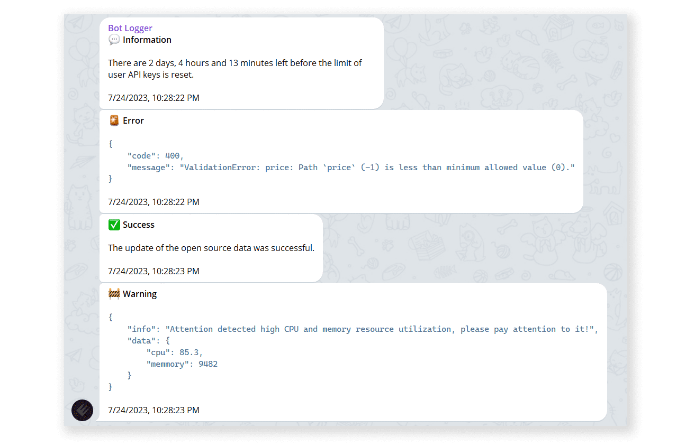

# Telegram Logger

A tiny module for sending logs to Telegram chats.

<p align="center"></p>

## Installation

```bash
npm install tglog
```

Import into your project:

```js
// ESM
import TelegramLogger from "tglog";
```

```js
// CommonJS
const { default: TelegramLogger } = require("tglog");
```

## Basic usage

To start logging messages in Telegram chats, you need to initialize a new instance of `TelegramLogger` class and pass it some required/optional parameters:

```js
// BOT_TOKEN https://core.telegram.org/bots/api#authorizing-your-bot
// CHAT_ID https://core.telegram.org/bots/api#chat
const tglog = new TelegramLogger(BOT_TOKEN, CHAT_ID, {
    // This is default options
    // All parametes below are optional
    messageThreadId: 0, // Unique identifier for the target message thread (topic) of the forum
    wrapAsCode: true, // Will format your messages as code
    ignoreErrors: true, // Will ignore internal errors that may occur in this module
    parseMode: "HTML", // https://core.telegram.org/bots/api#formatting-options
    disableNotification: false, // Users will receive a notification with no sound
    timeMetadata: true, // Adds time data to the end of the message
});
```

Now you can send messages as normal strings or any objects that will be serialized to JSON:

```js
tglog.info("Hello, World!");
tglog.err({ code: 400, message: "Something went wrong..." });
tglog.ok({ text: "Everything is OK!" });
tglog.warn({ info: "Need your attention!", data: { some: { nested: { object: "..." } } } });
```

> All methods can also take an object with parameters as a second argument to override default values...

## Documentation

To be continued...

## License

This project in under [MIT License](./LICENSE).
